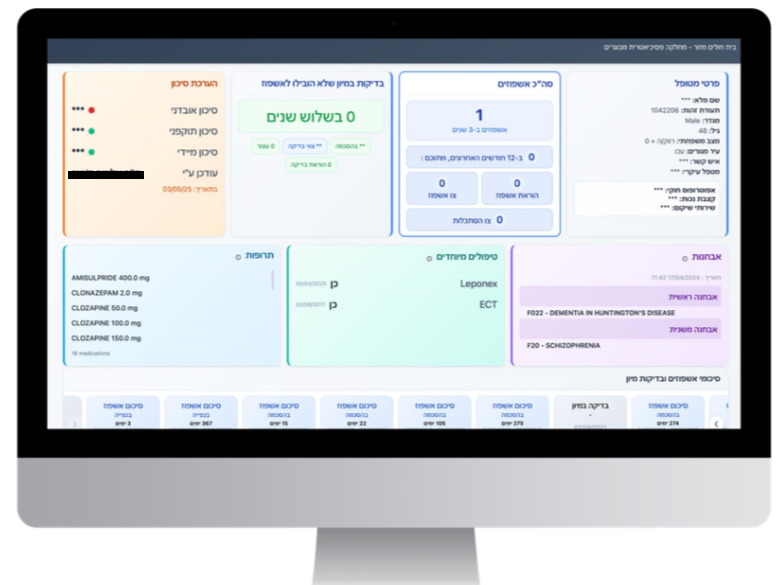
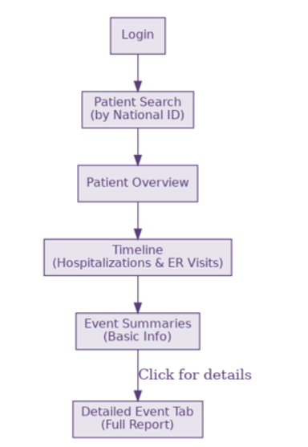
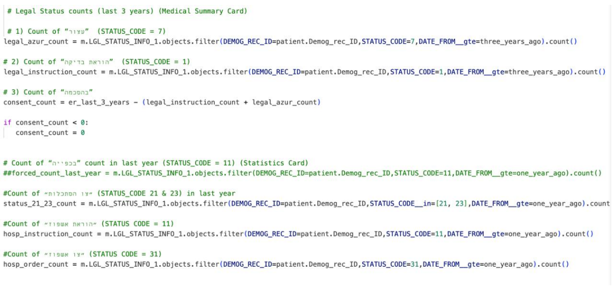
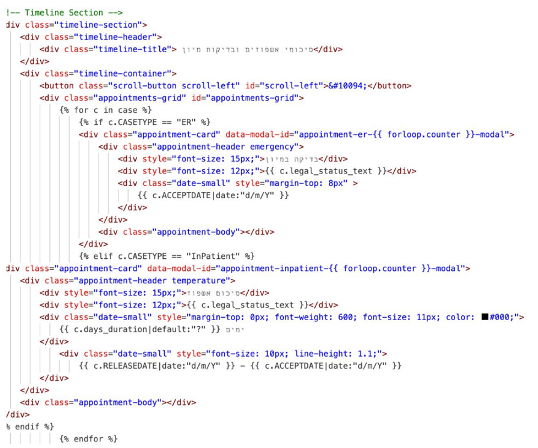

# Psychiatric Clinical Dashboard

### 360° Navigation Platform for Psychiatric Patient Management

A clinical dashboard developed as a final academic project designed to improve access to psychiatric patient information through a centralized and intuitive interface.

⚠️ **Privacy Notice**  
Due to patient privacy regulations and the use of real clinical data, the original source code and datasets are not publicly available. This repository focuses on project architecture, workflows, UI design, and implementation concepts only.

---

## The Problem

Psychiatric clinicians often work with long, fragmented, and unstructured patient records spread across multiple systems and screens.

Challenges included:

- Fragmented patient information
- Long textual records
- No timeline visualization
- Delayed access to insights
- High cognitive load for clinicians

---

## Proposed Solution

A read-only clinical dashboard designed to centralize psychiatric patient information into one intuitive interface.

Key features:

✅ Secure login  
✅ Patient search by ID  
✅ Patient overview dashboard  
✅ Hospitalization and ER timeline  
✅ Medication display  
✅ Diagnoses section  
✅ Risk assessment indicators  
✅ Special treatments tracking

---

## Technologies

### Frontend
- HTML
- CSS
- JavaScript

### Backend
- Django (Python)

### Database
- PostgreSQL
- SQL

### Security
- HTTPS
- Role-based authentication

---

## Dashboard Screens

### Patient Overview Dashboard

The dashboard provides a centralized view of psychiatric patient information including demographics, diagnoses, medications, treatments, hospitalization history, and emergency visits.

---
## System Architecture

.png)

Database → Backend → Frontend → User

---
## Workflow

The workflow begins with secure login, patient search, patient overview, timeline navigation, and access to detailed clinical summaries.

---

## Implementation Examples

### Legal Status Calculation Logic

Example of backend logic used for hospitalization statistics and legal status calculations.

### Timeline Component Rendering

Example of frontend timeline rendering logic displaying hospitalizations and ER visits chronologically.

---

## Product & UX Thinking

The dashboard was designed around real clinical workflow requirements:

- Reduce unnecessary clicks
- Minimize cognitive load
- Support faster decision making
- Provide quick access to critical patient data
- Maintain a clean and intuitive interface

---

## Future Development

- AI-powered risk prediction
- Integration with EHR systems
- PDF export support
- Real-time clinical input
- Additional medical modules
